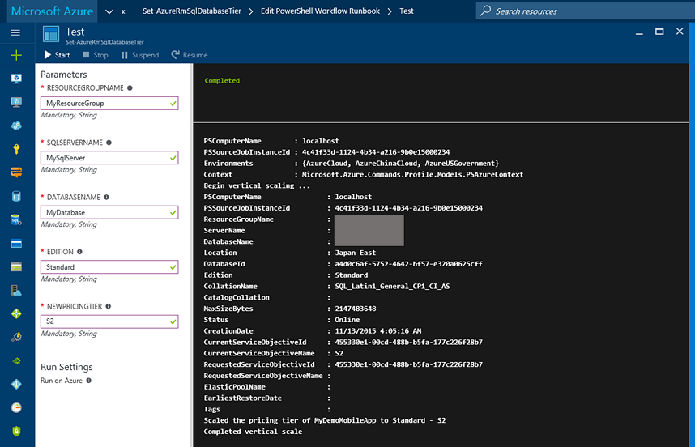

# Azure SQL Database: Vertically Scale

이 스크립트는 Azure Aumomation을 사용해서 특정 시간에 Azure SQL Database의 스케일을 변경할 수 있는 PowerShell Workflow Runbook입니다. 사실 Azure Automation Gallery에 이미 동일한 동작을 하는 스크립트가 올라와 있지만 그 스크립트는 현재의 버전의 Azure Automation에서는 올바로 동작하지 않는 것으로 보입니다. 해서, 현재 버전의 Automation에서 동작하는 스크립트를 한번 작성해 보았습니다. 

[Eng]   
This runbook enables one to scale (up or down) an Azure SQL Database on a schedule using Azure Automation.

You can also check the script on [https://gallery.technet.microsoft.com/scriptcenter/Azure-SQL-Database-e957354f#content](https://gallery.technet.microsoft.com/scriptcenter/Azure-SQL-Database-e957354f#content)
but, unfortunately It seems to not be working well on current Azure portal(V2).  

It might be not the best script but will work.



```powershell
workflow Set-AzureRmSqlDatabaseTier
{
	param
	(
        # Name of Resource Group
	    [parameter(Mandatory=$true)] 
	    [string] $ResourceGroupName,

	    # Name of the Azure SQL Database server (Ex: bzb98er9bp)
	    [parameter(Mandatory=$true)] 
	    [string] $SqlServerName,
	
	    # Target Azure SQL Database name 
	    [parameter(Mandatory=$true)] 
	    [string] $DatabaseName,
	
	    # Desired Azure SQL Database edition {Basic, Standard, Premium}
	    [parameter(Mandatory=$true)] 
	    [string] $Edition,
	
	    # Desired Pricing Tier {Basic, S0, S1, S2, P1, P2, P3}
	    [parameter(Mandatory=$true)] 
	    [string] $NewPricingTier
    )

	inlinescript
	{
	    $connectionName = "AzureRunAsConnection"
	    try
	    {
	        # Get the connection "AzureRunAsConnection "
	        $servicePrincipalConnection=Get-AutomationConnection -Name $connectionName         
	
	        "Logging in to Azure..."
	        Add-AzureRmAccount `
	            -ServicePrincipal `
	            -TenantId $servicePrincipalConnection.TenantId `
	            -ApplicationId $servicePrincipalConnection.ApplicationId `
	            -CertificateThumbprint $servicePrincipalConnection.CertificateThumbprint 
	    }
	    catch {
	        if (!$servicePrincipalConnection)
	        {
	            $ErrorMessage = "Connection $connectionName not found."
	            throw $ErrorMessage
	        } else{
	            Write-Error -Message $_.Exception
	            throw $_.Exception
	        }
	    }

        ## Set-AzureRmContext -SubscriptionId $subscriptionId
	    ## Set-AzureRmSqlDatabase -DatabaseName $DatabaseName -ServerName $SqlServerName -ResourceGroupName $ResourceGroupName -Edition $Edition -RequestedServiceObjectiveName $NewPricingTier
        
        Write-Output "Begin vertical scaling ..."
        Set-AzureRmSqlDatabase `
            -DatabaseName $Using:DatabaseName `
            -ServerName $Using:SqlServerName `
            -ResourceGroupName $Using:ResourceGroupName `
            -Edition $Using:Edition `
            -RequestedServiceObjectiveName $Using:NewPricingTier

	    # Output final status message
	    Write-Output "Scaled the pricing tier of $Using:DatabaseName to $Using:Edition - $Using:NewPricingTier"
	    Write-Output "Completed vertical scale"
	}
}
```