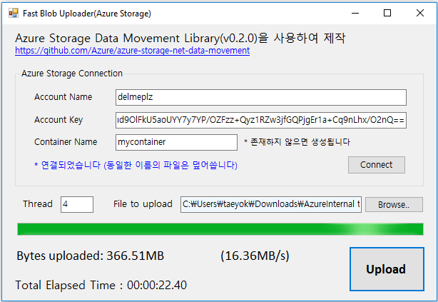

## Fast Blob Uploader(Azure Storage) 
- use Azure Storage Data Movement Library (0.2.0)
- Console, WinForm Sample
- 로컬 테스트 시에 AzCopy보다 나은 성능을 보임(it's faster than Azcopy in local test)
- 참고링크 [Microsoft Azure Storage Data Movement Library (0.2.0)](https://github.com/Azure/azure-storage-net-data-movement)
- Download binary(exe) at [here](binary/AzureStorageUpload.zip)
- 샘플 이미지    
    
